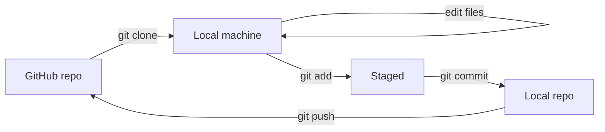
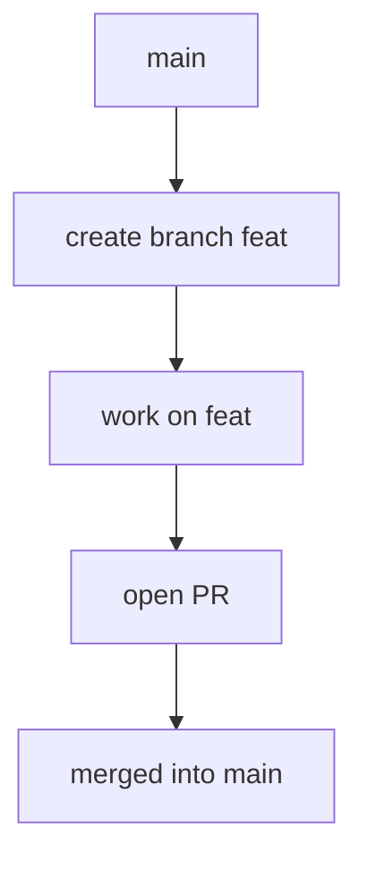
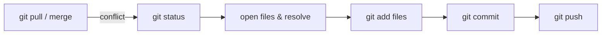
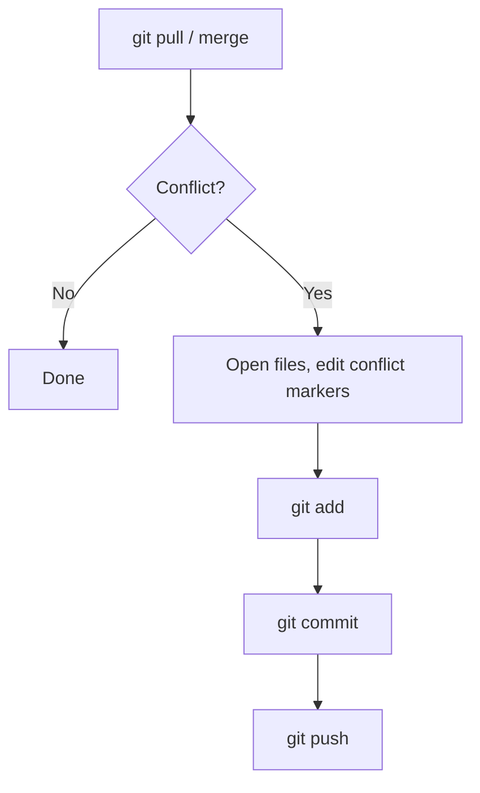

# Git and GitHub Repository

## Overview

**Git** is a distributed version control system that tracks changes to files in a repository.

**GitHub** is a cloud-based hosting service for Git repositories (remote/global).

* **Local** = your laptop / PC (your working copy).
* **Remote** = GitHub (shared, global repository).

---

## Glossary (short)

* `README.md` — file used to write information about the repository.
* `add` — stage files for the next commit (`git add`).
* `commit` — record a snapshot of staged changes with a message (`git commit -m "msg"`).
* `~` — often used to mean the home/root folder (context dependent).
* `origin` — default name for the remote repository that you cloned from or added.
* `main` / `master` — common default branch names (GitHub uses `main` by default nowadays).
* `.gitignore` — the .gitignore file is a plain text file that tells Git which files and directories to ignore in a project, meaning they will not be tracked, staged, or committed to the repository.

Status flags you may see in `git status` output:

* `M` — Modified (file changed and tracked).
* `A` — Added (file staged for commit).
* `U` — Untracked (file not tracked by git yet).
* `staged` — prepared to be committed.
* `unmodified` — not changed since last commit.

---

## Typical (General) Workflow

1. Create or clone a repository on GitHub.
2. `git clone` to copy it locally.
3. Make changes locally (edit files).
4. `git add` to stage changes.
5. `git commit -m "message"` to save a snapshot locally.
6. `git push` to upload commits to the remote repository on GitHub.

Mermaid flow (also later in the file):



---

## Setup & Configuration (first-time)

```bash
git --version
git config --global user.name "Your Name"
git config --global user.email "you@example.com"
git config --list
```

---

## Common Local ↔ Remote Commands

### Clone (remote → local)

```bash
# copy the repository URL on GitHub and run:
git clone https://github.com/<user>/<repo>.git
cd <repo>
ls -a   # see .git and hidden files
```

### Status, add, commit, push

```bash
git status             # view changes
git add <file>         # stage one file
git add .              # stage all changes in current folder
git commit -m "msg"   # commit staged changes with message
git log                # list commits
git push origin main   # push to remote 'origin' on branch 'main'
# after you set upstream once (git push -u origin <branch>) you can use 'git push'
```

### Pull (remote → local updates)

```bash
git pull origin main   # fetch + merge remote changes from 'main'
# or simply:
git pull
```

---

## Creating a New Local Repo and Pushing to GitHub

```bash
mkdir myproject
cd myproject
git init               # create a local git repo
# create files (README.md, code, etc.)
git add .
git commit -m "initial commit"
# On GitHub: create a new empty repository (do not initialize with README if you already have one locally)
# then add remote and push:
git remote add origin https://github.com/<user>/<repo>.git
git branch -M main     # rename current branch to main if needed
git push -u origin main
```

Notes:

* You cannot directly "upload" a local folder to GitHub without creating a repository on GitHub and connecting it via `git remote add`.

---

## Branching & Merging

### Create or switch branches

```bash
git branch              # list branches
git checkout -b feat    # create and switch to 'feat'
git checkout feat       # switch to existing branch
```

### Merge branches (local)

```bash
git checkout main
git merge feat
# Resolve conflicts if any, then:
git add .
git commit -m "Resolve merge"
git push origin main
```

### Merge via GitHub

* Open a Pull Request (PR) from one branch into another (e.g., `feat` → `main`) and merge using GitHub's UI.

Mermaid branch diagram:



---

## Merge Conflicts (resolution steps)

If both branches changed the same lines/files, you'll get conflicts.

Step-by-step:

```bash
git status                         # see conflict markers and files
# open conflicted files and edit to manually resolve (remove conflict markers <<<< >>>>)
git add <resolved-files>           # mark resolved
git commit -m "Resolve merge conflicts"
git push origin <branch>
```

A helpful conflict resolution flow:



---

## Undoing Changes

**Case 1 — Unstage changes (staged but not committed):**

```bash
git reset <file>    # unstage a file
git reset           # unstage all staged files
```

**Case 2 — Undo last commit (keep working tree):**

```bash
git reset HEAD~1    # move HEAD back by 1 commit (keeps local file changes unstaged)
```

**Case 3 — Reset to a specific commit (move HEAD there):**

```bash
git reset <commit-hash>            # moves HEAD (changes are unstaged)
git reset --hard <commit-hash>     # moves HEAD and discards working tree and staging (dangerous)
```

> Warning: `--hard` deletes local uncommitted changes. Use with care.

---

## Deleting Branches / Cleaning Up

```bash
git branch -d <branch>       # delete branch (only if merged)
git branch -D <branch>       # force delete
```

Delete all local branches except `main` (PowerShell example given in your notes):

```powershell
# PowerShell (Windows):
git branch | ForEach-Object { $_.Trim().Replace("* ", "") } | Where-Object { $_ -ne "main" -and $_ -ne "" } | ForEach-Object { git branch -D $_ }
```

Remove entire `.git` history (careful — irreversible locally):

```powershell
Remove-Item -Recurse -Force .git   # PowerShell
# or in bash:
rm -rf .git
```

---

## Forking & Contributing to Other Repos

* **Fork** a repository on GitHub to make your copy under your account.
* Clone your fork locally, make changes, commit and push to your fork.
* Open a Pull Request from your fork/branch to the original repository's branch to propose changes.

---

## Useful Misc Commands (quick table)

| Purpose                 | Command                                |
| ----------------------- | -------------------------------------- |
| Check git version       | `git --version`                        |
| Configure user          | `git config --global user.name "Name"` |
| Show config             | `git config --list`                    |
| Show status             | `git status`                           |
| Stage file              | `git add file`                         |
| Stage all               | `git add .`                            |
| Commit                  | `git commit -m "msg"`                  |
| View commits            | `git log`                              |
| Push                    | `git push origin main`                 |
| Pull                    | `git pull origin main`                 |
| Clone                   | `git clone <url>`                      |
| Create new repo locally | `git init`                             |
| Rename branch           | `git branch -M main`                   |
| Add remote              | `git remote add origin <url>`          |
| List remotes            | `git remote -v`                        |
| Remove remote           | `git remote remove origin`             |

---

## Commands from your notes (cleaned and included above)

* `q` — many Git editors (like `git commit` message editor using `vim`) use `q` to quit; depending on your editor, the key may differ.
* `clear` — clear the terminal screen.
* `ls`, `cd` — shell navigation commands.
* `ls -a` — show hidden files; `.git` indicates a Git repository.

---

## Safety & Best Practices

* Commit small, focused changes with clear messages.
* Pull regularly (`git pull`) before starting new work to reduce conflicts.
* Use branches for features and bugfixes (do not work on `main` directly).
* Avoid `git reset --hard` unless you are sure you want to discard changes.
* Review changes with `git diff` before committing or merging.

---

## Diagrams

### Workflow (Mermaid)

```mermaid
flowchart LR
  subgraph Remote
    GH[GitHub Repo]
  end

  subgraph Local
    W[Working Directory] --> S[Staging Area]
    S --> C[Local Commit (git commit)]
  end

  GH <-->|git push| C
  GH -->|git clone / git pull| W
```

### Merge Conflict Flow



---

